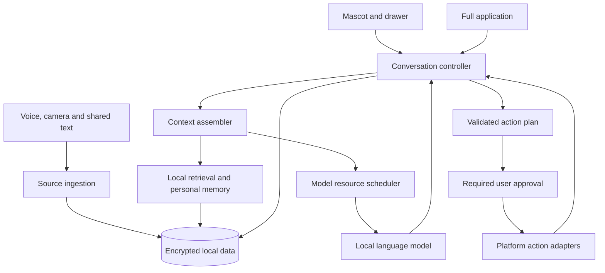

# Personal AI Companion: Implementation Plan

Created 26 September 2026; updated 28 September 2026. Status: foundation implementation exists; this document describes the target release, not completed functionality. Core inline recording and durable attachment composer behavior is implemented and emulator-tested; see [implementation results](../docs/COMPOSER_IMPLEMENTATION_RESULTS.md). Physical-device acceptance and local model integration remain pending.

Primary test device: the user's Samsung Galaxy S24 Ultra. Record its actual RAM, Android/One UI version, free storage, and thermal baseline during setup. Do not infer these from the model name.

This is the execution plan for the [approved screenshots](design/approved/README.md) and the [product direction](MVP_PLAN.md). It supersedes the earlier milestone ordering. All four screenshot boards are in scope for the first complete Android release. Gmail, optional online lookup, and iOS remain subsequent milestones.

## 1. Release Outcome

The user taps a floating mascot, keeps an ongoing conversation, speaks requests, shares text or documents, scans receipts, recalls saved information, and performs supported local actions. Opening the full app continues the same conversation. History, personal memory, source content, and reasoning remain on the device.

The first complete release includes:

- The approved mint mascot, draggable presence, listening state, conversation drawer, and full-app Chat/Memory/Sources navigation.
- Local streamed conversation with durable history, follow-ups, temporary conversations, stop/retry, and context reconstruction.
- Local push-to-talk transcription, voice notes, playback, and optional spoken responses using an installed offline voice.
- Tagged micro-notes, personal reminders, local-calendar integration when available, workout timers, and supported settings actions.
- Camera/gallery receipt and document capture, local OCR, editable expense extraction, a local expense ledger, and source-grounded document summaries.
- Local semantic retrieval over saved messages, notes, transcripts, and documents, with inspectable sources and editable personal memory.
- Text/code polishing, summarization, and translation for tested language pairs, initiated through explicit selection, sharing, or paste.
- Model setup, local storage management, permission recovery, deletion/export, and offline verification.

The mascot remains the primary everyday experience throughout development. Milestones are incremental demonstrations of this product, not replacements for it.

## 2. Approved Screens to Implementation

| Reference | UI to build | Supporting behavior | Acceptance example |
| --- | --- | --- | --- |
| S1 left, refined by S5: listening | Inline recording bubble in the existing chat composer, waveform, elapsed time, cancel/stop, subsequent review | Audio capture, local transcription when available, input state, microphone lifecycle | Recording never opens a separate screen; stop allows review before sending |
| S1 right: action preview | Continuous chat, combined reminder/note preview, destination, edit/confirm | Typed action plan, date resolution, calendar adapter, note storage, execution journal | One confirmation creates the requested items; a retry does not create duplicates |
| S2 left: full app | Same chat, source references, top-left side navigation for Chat/Memory/Sources/Settings | Persistent session, context assembly, retrieval, citations | Ask about Tuesday's meeting, then ask a follow-up without restating the meeting |
| S2 right: source detail | Playback, transcript, highlighted evidence, linked memories, edit | Timestamped transcript segments, source revisions, provenance | Tap a citation, inspect the relevant excerpt, play from its timestamp, correct a memory |
| S3 left: camera | Full camera surface, crop guides, shutter/gallery/flash, mascot | CameraX, selected-image import, image normalization, local OCR | Capture the sample receipt in airplane mode |
| S3 right: receipt discussion | Receipt thumbnail, editable extraction, save expense, conversational follow-up | OCR evidence, structured extraction, currency-safe amounts, ledger | Verify UGX 25,000 total and UGX 7,000 coffee; save only on command |
| S4 left: polishing | Shared-text attachment, iterative replies, copy/share | Android share/selection intake, bounded rewriting context, draft versions | "A little warmer" revises the latest draft while preserving the original |
| S4 right: timer | Conversational timer result, countdown, pause/stop | Monotonic timer state, persistence, alert scheduling | Start 15 minutes, pause/resume, expand the app, and retain the same timer |

### Design implementation rules

Build a small design system from the approved direction: white and cool-gray surfaces, graphite text, mint user messages, green controls, and the mint/coral mascot. Treat extracted colors as starting tokens and verify contrast. Use platform-readable type sizes, 48dp minimum touch targets, and predictable icon labels. Keep the source-reference and action components compact.

Produce clean transparent mascot assets for idle, listening, thinking, responding, success, and error. Reuse one character; add restrained blink/bob animation and honor reduced-motion settings. Do not ship a cropped screenshot as a production character asset.

Create reusable ConversationView, Composer, MascotView, ListeningPanel, SourceReference, ActionPreview, ReceiptReview, and TimerView components. The same ConversationView is hosted in the drawer and full app.

### Composer refinement approved 27 September 2026

The [inline recording and attachment implementation plan](COMPOSER_INPUT_PLAN.md) defines the updated input behavior in both chat hosts. The [S5 recording concept](design/approved/05-inline-recording.png) supersedes a separate microphone screen: recording replaces the input bar with a compact waveform bubble while the conversation stays visible. Stop enters review; nothing sends automatically.

The camera/attachment button first opens a bottom sheet with **Files**, **Camera**, and **Gallery**. Files supports multiple documents of any selectable type; Gallery supports multiple images through the system picker. A successful camera capture returns directly to the originating chat with a draft thumbnail. Image previews and document chips sit above the text field within the same composer; Send commits the prompt and ordered attachments as one message. Selection/import does not imply that the installed model can understand every format.

All three attachment entry paths must restore completed selections and the unsent prompt on reopening either chat host, including after process restart/reboot. Restore image thumbnails and supported document previews, with filename/type tiles for formats without a renderer. Sent attachments remain with their original message. See the composer plan's restoration contract for interrupted imports and error states.

Additional required screens/states: model installation and repair; missing permission; empty/new conversation; no search results; no available calendar; interrupted generation; low storage; OCR correction; source import progress; disabled notifications; stopped timer; history; memory editor; source library; expense list/detail; and local data settings.

## 3. Technical Decisions

| Layer | Starting decision | Validation or boundary |
| --- | --- | --- |
| Shared application | Kotlin Multiplatform, coroutines, StateFlow, kotlinx.serialization and kotlinx.datetime | Shared orchestration/data contracts; platform APIs remain in adapters |
| UI | Compose Multiplatform components with an Android host | Android-first delivery; retain reusable UI without assuming all surfaces port to iOS |
| Model runtime | llama.cpp via a small JNI/C++ adapter; pinned revision | CPU baseline, then Vulkan benchmark; LiteRT-LM is a timeboxed alternative if the chosen path fails |
| Conversation model | Quantized instruction model in approximately the 1B-4B class | Compare two candidates on the S24 Ultra; pin exact model/hash/license after quality and resource tests |
| Speech | whisper.cpp, initially compare tiny/base-sized speech models | Separate transcription from language generation; test accents, noise, dates, and names |
| OCR | CameraX + bundled ML Kit text recognition | Bundle required recognition assets for offline first use; start with Latin receipts/documents |
| Persistence | SQLDelight over SQLite; validate an encrypted Android driver backed by SQLCipher | Prove driver, migrations, FTS, and encryption together before personal data integration |
| Files | Encrypted app-private media and attachments, platform-protected keys | Thumbnails and temporary files are included, not just the main database |
| Retrieval | Local embedding encoder + full-text search, combined ranking | Separate embedding model from chat model; validate a compatible on-device runtime during foundation |
| Actions | Typed requests and platform adapters | No model-generated arbitrary intents, SQL, shell commands, or accessibility scripts |
| Background jobs | Persistent import/index jobs and Android WorkManager where appropriate | Not a precision timer or permanent inference loop |

Compose's shared UI relationship is documented in the [KMP documentation](https://kotlinlang.org/docs/multiplatform/compose-multiplatform-and-jetpack-compose.html). Engine capabilities and build entry points come from [llama.cpp](https://github.com/ggml-org/llama.cpp) and [whisper.cpp](https://github.com/ggml-org/whisper.cpp). [SQLDelight](https://sqldelight.github.io/sqldelight/2.1.0/) and [SQLCipher for Android](https://www.zetetic.net/sqlcipher/sqlcipher-for-android/) are separate layers; compatibility is an early deliverable, not an assumption.

Record stable dependency versions, Android target SDK, NDK, ABI and native-library page-size compatibility at project setup. Do not use floating native revisions or assume an NPU backend exists for every model. Verify license and redistribution conditions for every model and native library before packaging.

### Proposed repository structure

```text
androidApp/                  Android launcher, overlay/capture hosts, permissions
  src/main/cpp/              JNI bridge and pinned native build integration
shared/                      KMP domain, orchestration, persistence contracts
  src/commonMain/kotlin/
    conversation/            sessions, generation, context assembly
    memory/                  source-backed memories and retrieval
    sources/                 imports, provenance, indexing jobs
    actions/                 plans, validation, execution journal
    models/                  asset manifests, readiness, resource scheduling
  src/commonMain/sqldelight/ database schema and migrations
  src/androidMain/           database, engine, files, calendar/system adapters
ui/                          KMP Compose screens, components, design tokens
benchmarks/                  repeatable device workloads and result templates
test-fixtures/               synthetic notes, receipts, audio and conversations
planning/design/approved/    approved image references
docs/decisions/              short records of model, driver and platform decisions
```

Keep these initial modules coarse. A separate Gradle module per feature is unnecessary. Add an iOS app host in its own milestone; keep common code independent of Android types now.

For the current codebase, the [codebase organization plan](CODEBASE_ORGANIZATION_PLAN.md) is the concrete package map and takes precedence over the illustrative folder sketch above. First group related UI under feature-local screen/components/viewmodel packages, extract shared design-system elements, split conversation model/data/session responsibilities, and place bindings in module-owned di packages. Keep stable Android entry components, application/database identifiers, generated resources, and the existing three-module dependency direction. C00 is a behavior-preserving refactor before attachment changes, not a framework or module rewrite.

### Runtime structure



## 4. Mascot, Hosts and Session Lifecycle

Use a user-enabled TYPE_APPLICATION_OVERLAY for the collapsed mascot. Support drag, snap-to-edge, dismiss, resume, screen insets, rotation, lock/unlock, and permission revocation. A visible service notification provides stop/open controls while the overlay service runs.

The editable drawer uses its existing separate translucent foreground Activity, including keyboard focus and back navigation. Acquire microphone access while that chat host or the full app is visible, and render recording inline; do not launch a separate audio Activity. Camera scanning uses a visible Activity launched for a result from the attachment sheet and returns to the originating chat. Verify these transitions on the S24 Ultra.

Overlay permission does not by itself satisfy microphone/camera while-in-use rules. Start foreground services from allowed user-visible states, declare applicable service types, and validate the overlay purpose against Play's requirements early. The visible-overlay background-start exemption has additional requirements on Android 15+. [Android start restrictions](https://developer.android.com/develop/background-work/services/fgs/restrictions-bg-start), [service types](https://developer.android.com/develop/background-work/services/fgs/service-types), [Play declarations](https://support.google.com/googleplay/android-developer/answer/13392821).

An application-scoped ConversationController owns activeConversationId, generationId, draft, attachments, and action state. UI hosts observe this state; they do not each instantiate a model session. Expanding or collapsing between hosts transfers observation without duplicating work.

Define these lifecycle rules:

- Expanding into the full app preserves an active generation and its ID.
- Dismissing the conversation entirely saves the draft, cancels generation, and marks any partial answer Interrupted; reopening offers retry. It does not silently finish an action in the background.
- Cancelling transcription never executes a partially recognized command.
- Stopping the mascot service stops its presentation and unneeded inference, but persisted timers/reminders retain their own scheduling state.
- Screen lock stops capture and hides private conversation content; resumption requires an unlocked device.
- Process restart reloads history and pending states; it never replays an external action solely because a request appears in chat.

If overlay permission is unavailable, the full-app experience remains usable. A platform failure affecting the approved mascot flow is an explicit release issue, not grounds for silently changing the product.

## 5. Local Models and Resource Budget

Implement a ModelManager with verified manifests for language, speech, embedding, and optional voice assets. A manifest records model ID, version, hash, byte size, license, tokenizer/template, context limit, runtime compatibility, and supported languages. Support explicit download, resume, cancellation, insufficient-storage handling, hash verification, atomic installation, and rollback to a working version. Public model weights may remain unencrypted; personal data may not.

Offer an internal-test sideload path for model bundles. Only show a feature as offline-ready when its required assets are installed and verified. Missing models produce a setup state, not an automatic network or cloud-inference fallback.

Use a resource scheduler with priorities: active capture, current user response, requested source processing, then background indexing. Avoid simultaneously holding the largest language, speech, and embedding sessions on the GPU. Release or pause lower-priority workloads, handle native cancellation safely, and unload idle models without losing conversation history. Record actual process PSS, native memory, context/KV cost, and temperature.

The speech pipeline is microphone -> audio frames and live waveform -> voice activity detection -> partial/final transcript -> local language model. Partial transcription is provisional; intent execution uses final, validated text. The language model is not assumed to transcribe raw audio itself. Streaming examples in [whisper.cpp](https://github.com/ggml-org/whisper.cpp) are starting points to validate, not a production speech UX guarantee.

A 200ms target applies to visual feedback, not completed transcription or model reasoning. Establish these provisional S24 Ultra goals and revise openly after measurement:

| Workload | Initial engineering target |
| --- | --- |
| Tap -> visible listening/working feedback | p95 <=150ms, independent of model loading |
| Warm first token, <=1,000 input tokens | p95 <=3 seconds |
| Cold load + first token | p95 <=12 seconds on the selected model |
| Final transcript after a short utterance ends | p95 <=2 seconds for a 10-second clip |
| Retrieval, 5,000 indexed passages | p95 <=500ms after the index is ready |
| Receipt capture -> review | p95 <=6 seconds on the documented image workload |
| Peak process PSS | Starting target <=2.5 GiB, measured across all feature pipelines |
| Idle mascot overhead | <=1 battery percentage point/hour above paired idle baseline, across three runs |

Record cold and warm results separately, include long-context tests, and run a 20-minute mixed workload for thermal degradation. These are release-planning targets, not advertised measurements. If a tiny model cannot sustain the conversation/retrieval tests, choose a larger viable model rather than converting the assistant into a command-only parser.

## 6. Conversation, Memory and Local Retrieval

Persist messages with role, content, timestamp, generation status, and source references. Persist drafts and selected source IDs. Summaries store the range and revisions of messages they cover. Recent turns and a summary support continuity; original messages remain the record of what was said.

For every request, ContextAssembler reserves output space, includes the current request, recent relevant turns, current attachment/draft, approved memories, and retrieved source passages. Trim within the model's measured token budget. Retrieve original content when a summarized detail matters. Never put the entire lifetime conversation or entire document collection into one prompt.

Ingestion runs: explicit import -> normalize -> extract/OCR/transcribe -> timestamped/page-addressable chunks -> local embeddings + FTS -> ready. All jobs are persisted, cancellable, and resumable. A newly attached document can support the current conversation before long-term indexing completes; expose Indexing when collection-wide retrieval is not ready.

Use a local embedding encoder selected in the foundation benchmark, with its own tokenizer/pooling rules. Combine semantic and keyword candidates, rank them, and enforce a bounded evidence budget. Begin with exact vector similarity at the reference corpus size; add an ANN index only if measured latency requires it. Avoid requiring a SQLite vector extension before its compatibility with encryption and both platforms is proven.

Source citations must be assembled from retrieved source IDs and spans; reject fabricated IDs. Store page/bounding-box or transcript timestamp references. Opening a citation takes the user to that exact revision/excerpt. Grounded answers should say when the requested fact was not found instead of inventing it.

Memory supports explicit "remember", correction, forgetting, and inferred suggestions awaiting confirmation. Track origin, source revision, status, and updated time. A quoted speaker's preference is not automatically the user's preference. Temporary conversations persist no history, source imports, or derived memory after their session ends.

### Data model

| Record | Essential fields |
| --- | --- |
| Conversation / Message / Draft | IDs, role, text, created time, status, active attachments, generation ID |
| ConversationSummary | conversation ID, covered message range, revision, text |
| Source / SourceRevision | type, title, origin/account, imported/updated times, content hash, storage reference, lifecycle state |
| SourceChunk / Embedding | source revision, text span/page/timestamp, embedding model version, vector |
| Memory / Provenance | fact/preference, proposed/confirmed state, source/message references, superseded-by link |
| Note / Tag | original text, optional title, tags, source reference |
| Expense / ExpenseItem | merchant, date, currency, integer minor-unit amounts, OCR provenance, review status |
| ActionPlan / ActionStep | typed payload, confirmation version, idempotency key, state, platform result IDs |
| Reminder / Timer | title, trigger instant/timezone or duration/monotonic deadline, paused remaining duration, scheduling state |
| ModelAsset / IngestionJob | hash/version/readiness; job stage, checkpoint, error |
| Future SourceConnection | provider/account, granted access, sync cursor/time, revocation state; no raw token in prompt data |

Deleting sources invalidates chunks, embeddings, dependent summaries, and derived memory. Source corrections create a new revision and rebuild affected indexes. Existing chat quotations remain visible unless that history is also deleted; deletion UI must describe and offer both options. Cleanup jobs should be transactional where possible and recoverable across interruption.

## 7. Feature Pipelines

### A. Voice, micro-notes and meeting sources

Implement push-to-talk with live waveform, partial transcript, editable final transcript, stop/cancel, audio-focus handling, and interruption recovery. Save raw audio only when the user chooses a voice note or recording; transient command audio is discarded after use. Include imported audio and explicitly started meeting recordings to support the source screen. Segment longer recordings and retain timestamps; do not assume reliable speaker identification.

Voice notes become local sources with playback, transcript search, tags, and linked memories. Correcting a transcript reindexes its affected chunks. A spoken answer is optional and uses only an installed offline voice; otherwise retain the text answer.

### B. Actions, reminders and timers

The model proposes a closed set of typed operations: SaveNote, CreateReminder, CreateCalendarEvent, SaveExpense, StartTimer, PauseTimer, ResumeTimer, StopTimer, SetDnd, SetBrightness, and SetTorch. Each adapter exposes availability, prerequisites, confirmation policy, and structured results. Unsupported operations are explained conversationally.

Use Proposed -> NeedsInput/NeedsPermission -> Ready -> Confirmed -> Executing -> Succeeded/Partial/Failed/Unknown. Each edit changes the plan version and invalidates approval. Direct low-impact commands such as starting or pausing a timer can run without a second confirmation. Calendar writes, grouped creations, expenses, and settings changes use the compact preview. Spoken confirmation can refer only to the current, unambiguous plan.

Dates are resolved by application time logic using the device clock and timezone. Missing/ambiguous AM/PM, past times, calendar duration, and conflicting instructions require clarification or an explicitly reviewed value. Do not let the model silently invent an event's end time.

The S1 calendar destination must be real. Discover writable calendars; use an actual local calendar when available. A synced calendar can upload the event through its provider, so show its account and request explicit choice. When no local calendar exists, offer an app-owned reminder instead of falsely labeling a cloud calendar local. CalendarContract requires the relevant read/write permissions; Calendar intents can hand control to the calendar app but do not prove completion. [Calendar provider](https://developer.android.com/identity/providers/calendar-provider).

Persist grouped note/calendar actions in a step journal. Local DB changes can be atomic, but the calendar provider and the database cannot share a transaction. Record results per step; reconcile interrupted calendar writes before retrying. When completion cannot be established, report Unknown and ask the user to inspect instead of blindly inserting again. Support compensation only for verified app-created records and do not delete subsequent user edits.

Timers use a monotonic deadline while running and a persisted remaining duration while paused. Countdown UI derives from time, never decrements a counter as the source of truth. Persist wall-clock recovery metadata for reboot; show overdue/recovered status on relaunch. Use AlarmManager for alerts, exact access where justified and granted, and make reduced-precision behavior explicit when unavailable. Never treat WorkManager as a precise timer. Test Doze, revoked access, process death, reboot, channel disablement, and force-stop/relaunch. [Alarm guidance](https://developer.android.com/develop/background-work/services/alarms).

### C. Receipt and document scanning

Open the Files/Camera/Gallery attachment sheet from the chat composer in either host. Camera opens the visible CameraX host; successful capture returns to chat with the image attached to the unsent prompt. Gallery uses a multi-image system picker, and Files uses a multiple-document picker. Support orientation correction and optional crop/rotate/retake from attachment preview without requiring a separate post-capture screen. Implement the shared draft/import foundation in P1/P2, then add OCR and receipt understanding in P5. Bundle ML Kit text recognition so the first scan does not depend on a dynamic model download. [CameraX](https://developer.android.com/media/camera/camerax), [bundled OCR](https://developers.google.com/ml-kit/vision/text-recognition/v2/android).

Keep the original image, OCR text, and coordinates as source evidence. Feed OCR text to the local model for extraction/summarization; a vision-language model is not required for these pictured features. Support plain text and PDF text extraction, with per-page OCR for scanned PDFs, explicit size/page limits, and cancellable background ingestion.

Receipt extraction returns merchant, date, currency, line items, tax/discount, and total with source spans. Parse and validate monetary values deterministically using currency-aware integer minor units. UGX has no decimal minor-unit fraction in this ledger. Do not store financial totals as binary floating point. When totals disagree or fields are uncertain, mark them for review. The editable review is authoritative; Save expense persists the reviewed version and its provenance.

The expense ledger provides list, category/date filters, totals by currency, edit/delete, receipt lookup, and explicit export. Never sum different currencies without an explicit conversion feature. Duplicate source hashes warn before a repeated import; repeated save taps are idempotent. A receipt available in the current conversation can answer "How much was coffee?" before the expense has been saved.

Long document summaries use chunked extraction/summarization with page citations. OCR errors and model inferences remain distinguishable from the original text; do not label the output authoritative legal or medical interpretation.

### D. Drafting, polishing and translation

Use ACTION_SEND for explicit sharing and ACTION_PROCESS_TEXT where the source app offers selection actions. Honor the read-only flag; return replacement text only on an explicit Replace action in a writable selection flow. Copy and Share remain universal output paths. No clipboard polling or automatic reading of the app behind the mascot. [Android text-processing contract](https://developer.android.com/reference/android/content/Intent#ACTION_PROCESS_TEXT).

Store the original and each draft revision in the current conversation. Follow-ups such as "warmer" apply to the latest draft. Preserve names, amounts, dates, code fences and stated meaning unless asked to change them. Code polishing returns a draft and never executes generated code. Translation requires a user-selected target language and a tested model/language pair; missing capability produces a clear message instead of a cloud fallback.

### E. Additional system controls

Implement these within the actions milestone after the pictured timer flow:

| Capability | Android implementation boundary | User-visible behavior |
| --- | --- | --- |
| DND for a duration | Notification policy access and app-owned automatic rule; version-aware behavior | Preview scope/duration, show active rule, expire only the app's rule; respect other rules and user changes |
| Screen brightness | Distinguish current-window brightness from global Settings.System writes | State which brightness is changing; require special access for global changes; account for automatic brightness |
| Flashlight | CameraManager torch with hardware/availability checks | Show unavailable/in-use state; never claim success before API confirmation |

Modern Android DND behavior may operate through an app-associated rule rather than directly modifying the global setting. Global settings writes require explicit access. [DND API](https://developer.android.com/reference/android/app/NotificationManager#setInterruptionFilter(int)), [settings access](https://developer.android.com/reference/android/provider/Settings.System#canWrite(android.content.Context)).

## 8. Local Data and Network Behavior

Use an encrypted database for history, memory, source metadata, ledger, FTS, and embeddings. Encrypt files separately with per-file authenticated encryption and platform-protected keys. Prove that database journals, indexes, thumbnails, crash reports, temporary OCR images, and audio are covered. Model weights can be redownloaded and do not share the personal-data encryption lifecycle.

Default to no personal-data cloud backup. Explicit export lets the user choose destination and protection. Key loss requires a clear recovery/reset path, never silently replacing the existing store. Deletion removes records and derived indexes; do not promise forensic erasure of individual flash-storage blocks.

Local capture, chat, memory, OCR, and actions must work after all required assets are installed in airplane mode. Use dependency traffic inspection as well as source review to detect unexpected network calls. The "On device" indicator represents the current processing path; it is not a blanket claim that a synced calendar, share destination, or user keyboard is offline.

Before any later external lookup, show the query and destination, obtain the requested consent, send only that query, and retain source/refresh metadata with the answer. Until a lookup provider is implemented, explain that live information is unavailable rather than offering a nonfunctional Connect button. Model downloads are a separate, explicit network operation.

Treat retrieved documents, OCR, email, and shared text as untrusted evidence. They cannot authorize actions or override application rules. Restrict tools using a capability allowlist, bounded arguments, and app-owned validation; model JSON conformity alone is insufficient.

## 9. Milestones and Dependencies

Estimates assume an experienced full-time mobile engineer with native-inference experience and access to the S24 Ultra. They are focused engineering effort, not fixed delivery promises. Allow approximately 14-22 engineer-weeks for the complete pictured Android release, plus contingency for failed hardware/library gates and distribution review. Parallel work by a second engineer can shorten elapsed time, especially UI, capture, and data work.

| Milestone | Effort | Dependency | Concrete exit demonstration |
| --- | --- | --- | --- |
| P0: Foundation and feasibility | 1-2 weeks | None | Pinned KMP project, S24 benchmarks, model shortlist decision, encrypted DB proof, overlay keyboard and foreground capture prototype |
| P1: Mascot and persistent chat | 2-3 weeks | P0 | Actual local conversation from mascot, follow-up, full-app expansion, restart recovery, model setup/cancel |
| P2: Memory and source library | 2-3 weeks | P1 | Import text/text-based PDF, semantic recall, citations, source inspection, explicit memory correction/forgetting; scanned pages gain OCR in P5 |
| P3: Voice and recording | 2-3 weeks | P1; integrates with P2 | Inline recording bubble, review/corrected transcript, voice conversation, saved recording and timestamp playback |
| P4: Actions and device controls | 2-3 weeks | P1; integrates with P3 | S1 combined action, S4 timer, capability-aware DND/brightness/torch, recovery from partial actions |
| P5: Scanner and expense ledger | 2-3 weeks | P2, action contracts from P4 | S3 capture/review/save, receipt follow-up, document summary, ledger edit/filter/export |
| P6: Polishing and translation | 1-2 weeks | P1, shared-text intake from P2 | S4 selection/share, iterative revisions, copy/share/replace, evaluated language pairs |
| P7: Integrated hardening | 2-3 weeks | P1-P6 | All reference scenarios offline on S24 Ultra, lifecycle/resource/privacy evidence, signed internal APK and tester feedback |

P2/P3/P4/P6 can partly overlap after the shared conversation contract stabilizes. P5 depends on actual source and action foundations. Include unit, integration, and UI checks in each milestone; P7 handles cross-feature validation, not the first testing effort.

The composer work is sequenced as C00-C06 in [COMPOSER_INPUT_PLAN.md](COMPOSER_INPUT_PLAN.md): package organization, shared draft/storage and restoration, attachment UI, file/gallery imports, camera return, inline recording, then integrated QA. These are work packages within the existing roadmap, not additional numbered phases. The roadmap remains eight phases, P0-P7; file selection and capture can ship before model-based analysis is ready. Reopen/restart preview restoration is a required gate, not a later enhancement.

### First implementation tickets

| Ticket | Task | Done when |
| --- | --- | --- |
| F01 | Establish Gradle/KMP modules and version catalog | Android debug build and shared tests run reproducibly |
| F02 | Prepare the S24 Ultra test record | OS/One UI/RAM/storage recorded; installed debug app and repeatable profiling workflow |
| F03 | Rebuild approved design components | Mascot/drawer/full-app mock-data screens render with keyboard, large text, and TalkBack labels |
| F04 | Validate overlay and capture lifecycle | Tap-to-open, type, record, rotate, lock/unlock, stop, and revoked permission exercised on device |
| F05 | Benchmark model pipelines | Two LLM candidates, speech and embedding candidates measured with documented workloads and licenses |
| F06 | Prove encrypted SQLDelight storage | Migration, FTS query, file protection, reopen/key-error behavior, and deletion test pass |
| F07 | Implement ModelManager and resource scheduler | Interrupted download recovers; corrupt asset is rejected; cancel/release cannot race native generation |
| F08 | Implement conversation repository/controller | Same conversation ID in both hosts; streaming and interrupted-state persistence work |
| F09 | Integrate the first real local response | Ask, follow up, expand, dismiss, reopen and resume in airplane mode |

Do not gate all product progress on designing every connector. Preserve their source contracts and implement the approved offline flows first.

## 10. Verification and Release Gates

Keep a synthetic fixture corpus in the repository; private tester data stays off source control and remote CI. Use a separate held-out corpus for measuring model behavior. Save model hashes, prompts, device configuration, and results so regressions are reproducible.

| Area | Required evidence |
| --- | --- |
| Conversation | At least 30 multi-turn scripts including correction/topic changes; >=90% correct expected follow-up references; no cross-conversation leakage |
| Tools | 100 supported/unsupported/ambiguous requests; >=95% correct supported field extraction; all invalid/unauthorized operations rejected by deterministic checks |
| Memory/RAG | 50 answerable and 20 unanswerable questions; >=90% supported answers on the answerable set; >=95% abstention on unanswerable fixtures; every returned citation resolves |
| Speech | Names, times, noisy clips, silence and cancellation; capture-transcribe-edit-confirm scenarios succeed; silence never launches an action |
| OCR/receipts | At least 50 clean and degraded receipts/documents; >=95% correct currency/total on clean supported samples; edits persist and uncertain fields remain reviewable |
| Money/time | Deterministic currency, rounding, relative-date, timezone, DST, timer pause/resume and reboot tests |
| Persistence | Process kill, schema migration, interrupted indexing, source revision, duplicate action recovery, key failure, clear-all and export |
| UI | S24 screenshots compared against S1-S4; compact emulator layout, keyboard-open, landscape, 200% font scale, contrast, TalkBack and reduced motion |
| Offline/privacy | Fresh model-ready install in airplane mode completes all local scenarios; traffic capture of an online local-only session identifies no unexpected feature traffic |
| Runtime | Provisional latency/memory targets measured, no ANR/OOM in the 20-minute mixed workload, deterministic capture/model cancellation |
| Distribution | Required foreground service/permission declarations, model/library notices, privacy and data-safety descriptions match actual behavior |

Use common Kotlin tests for context selection, data rules and state transitions; Android instrumentation for real platform adapters; Compose UI tests and screenshot comparisons for the approved layouts; native stress tests for cancellation/load/unload. Emulators verify layouts and API behavior; the S24 Ultra is the performance authority. Before broader device claims, repeat on a second vendor/device profile.

The release demo must cover the complete sequence: speak a request through the mascot -> confirm note/reminder -> ask a follow-up -> expand into full chat -> recall a saved source -> scan a receipt -> ask about one item -> polish shared text -> run a timer -> restart -> continue the conversation. Every step uses actual local pipelines, not scripted responses.

## 11. Subsequent Milestones

### Gmail and other sources

Implement SourceConnector authorization, scoped import, normalized local records, incremental synchronization, freshness, revocation, and deletion. Begin with read access, then evaluate write actions separately. Reuse the same retrieval and source-detail UI. Downloads/contact with the provider are online; reasoning over cached content is local.

Gmail read scopes can be restricted and require verification. Investigate scope and distribution requirements before committing a release date. Provider verification is not removed merely by keeping the model on device. [Gmail authorization scopes](https://developers.google.com/workspace/gmail/api/auth/scopes).

### Optional external information

Build only explicit, user-approved lookup for information absent locally. Keep query preview, source citations, cache dates, and offline behavior. General web scraping and a cloud agent are not dependencies of the assistant.

### iOS companion

Reuse KMP conversation, storage contracts, memory, and supported UI. Add platform inference/secure-storage/capture adapters and platform-supported app entry points. Plan an iOS interaction design separately; Android overlay behavior is not an iOS acceptance requirement. Validate each native capability before representing it in the UI.

## 12. Decisions to Close During P0

The product and approved visuals are settled enough to begin. Resolve only the remaining engineering facts: exact S24 software/resources; model and embedding bundle; native acceleration choice; encrypted driver compatibility; overlay/capture host behavior; available local calendar; offline speech/voice languages; measured baseline and supported Android versions. Record decisions and evidence, then proceed through the milestones.
